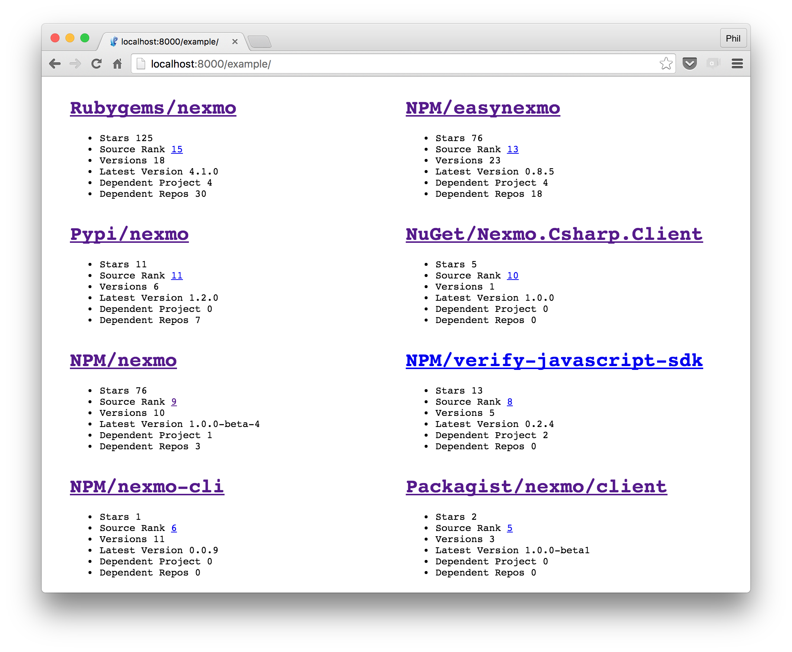

# Project Stats Web Component via [libraries.io](https://libraries.io) data



## Usage

Install dependencies:

```sh
bower install https://github.com/leggetter/librariesio-project-stats.git
```

Add dependencies to the page and instantiate `librariesio-project-stats` components:

```html
<script src="./bower_components/es-promise/promise.min.js"></script>
<script src="./bower_components/fetch/fetch.js"></script>
<script src="./bower_components/webcomponentjs/webcomponents.min.js"></script>
<script src="./bower_components/src/librariesio-project-stats.js"></script>

<librariesio-project-stats
  package-platform="npm" 
  package-name="nexmo">
</librariesio-project-stats>
```

## Example

See [example/index.html](./example/index.html).

## License

MIT
